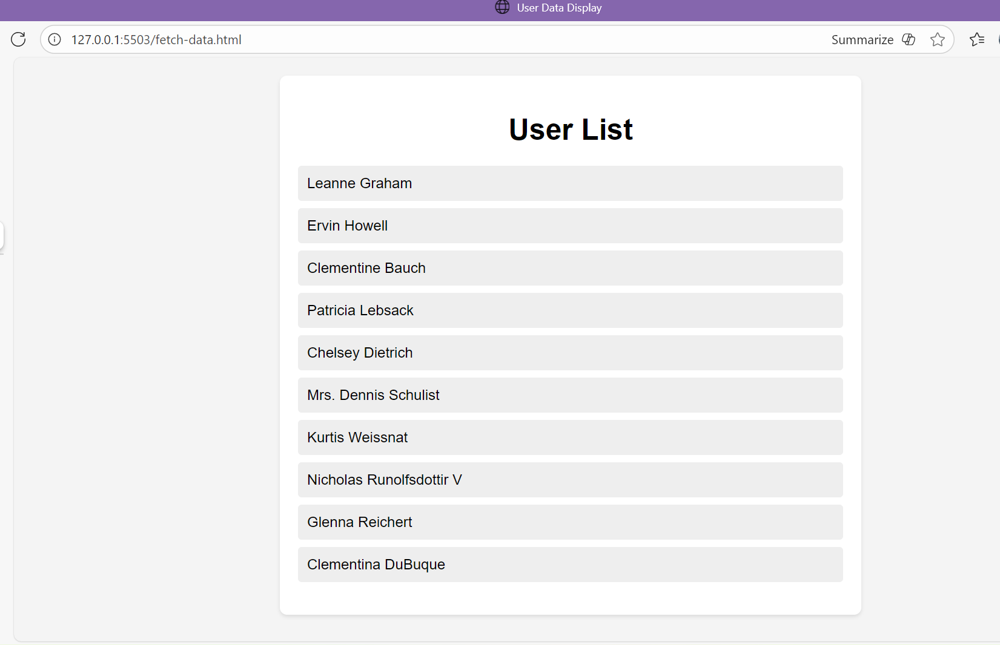

# 📝 Form Creation & Validation

A simple web application to demonstrate form creation and client-side validation using **HTML**, **CSS**, and **JavaScript**.  
The project ensures users provide correct input before submitting, improving user experience and data integrity.

---


### Ths is my first interactive web development journey from the alx learning.
### Made the simple form-validation to make interactive with the addition of HTML5 validation in js
## 📸 Screenshot


---

## 🛠️ Features
- Create forms with multiple input types (text, email, password, etc.)  
- Real-time input validation with JavaScript  
- Error messages and visual feedback for invalid input  
- Responsive and user-friendly UI  
- Prevent form submission if validation fails  

---

## 🧰 Tech Stack
- **HTML** — structure of forms  
- **CSS** — styling and responsive design  
- **JavaScript** — form validation logic  

---

## 🚀 Usage / How to Run
1. Clone the repository  
```bash
git clone https://github.com/amanuel1221/Form-Creation-Validation.git
Open the index.html file in your web browser

No additional setup is required — it’s a pure front-end project.

📂 Folder Structure
css
Copy code
Form-Creation-Validation/
│── index.html          # Main HTML form
│── styles.css          # CSS styling
│── script.js           # Form validation logic
│── Screenshot 2025-12-02 101026.png  # Screenshot of the form
│── README.md
💡 Future Improvements
Add more complex validation rules (e.g., password strength, confirm password)

Integrate with backend to store form submissions

Enhance UI/UX with animations and error highlighting

Add multi-step forms for complex workflows

👤 Author
Amanuel — Frontend developer & ALX student

📄 License
Open-source for learning and personal projects.

yaml
Copy code
